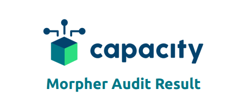

# Introduction
This is the repository for the core Morpher smart contract components of https://morpher.com

Morpher Smart Contracts are a collection of solidity files for on chain transactions and trustless state recovery from sidechain.

  

---

Morpher rebuilts financial markets from the ground up on the Ethereum Blockchain. All in the pursuit of the perfect trading experience.


# Audit

Morpher Smart Contracts are fully and regularly audited.

The Smart Contracts were last audited by Capacity and passed on Mon. Apr 20 14:24:19 2020 +0200 at the following commit https://github.com/Morpher-io/MorpherProtocol/commit/3090075bdd3a6c866d067c7c8c2164262497374f

You can find the full PDF with the Results here:

[](./docs/Capacity-MorpherAudit2Result.pdf)


# Getting Started
## Prerequisites
* Install Ganache https://www.trufflesuite.com/ganache on your system and run it successfully on port 7545.

* Install Node.js, Npm and build-essential (Linux and MacOS package to build Web3 C/C++ files) on your computer. 

In the Ubuntu Linux terminal:

`curl -sL https://deb.nodesource.com/setup_12.x | sudo -E bash -`

`sudo apt-get install nodejs` for node and npm

`sudo apt-get install build-essential`

* Git clone this repo and `cd` into it.

## How to run the tests
Run the following commands to start the test suite.
* `npm install` to install all the truffle/node dependencies.
* Rename .env.example to .env and input all the required variables. If you're testing locally with Ganache, you only need to input `MORPHER_DEPLOYER` and `MORPHER_DEPLOYER_KEY` which is the first account you see in the Ganache GUI.
* When everything is configured correctly, run the last command: `./node_modules/truffle/build/cli.bundled.js test --network local
`

If you want to see exactly what assertions are being made, you can take a look at the `test` folder.


# Smart Contract Components

There are several components playing together, these are here described in more detail in order of their importance.

## MorpherState.sol


This smart contract is _the brain_ of what happens with users, balances, trading and governance. It is the central point which stores balances for each user. It also stores the addresses of other smart contracts, such as the ERC20 token, the bridge or the governance functionality.

## MorpherToken.sol

It is the ERC20 Compatible token for Morpher. All the balances are stored in MorpherState.sol, it's just the interface.

## MorpherTradeEngine.sol

This is the contract that processes and stores orders. The orders can only be given by the oracle smart contract. This smart contract is the trusted entity taking prices from outside into the sandboxed blockchain.


## MorpherBridge.sol

Morpher Bridge takes care of bridging functionality from Main-Chain to Side-Chain and vice versa. It contains functionality to burn tokens upon deposit on the main-chain and credit (or mint) tokens on the side-chain. It can also take the merkle-proofs from the side-chain and let you withdraw tokens on the main-chain. 

If side chain operator doesn't write a merkle root hash to main chain for more than 72 hours positions and balaces from side chain can be transferred to main chain.

## MorpherGovernance.sol

Every user able and willig to lock up sufficient token can become a validator of the Morpher protocol. Validators function similiar to a board of directors and vote on the protocol Administrator and the Oracle contract.

## MorpherAirdrop.sol

Holds the Airdrop Token balance on contract address. AirdropAdmin can authorize addresses to receive airdrop. Users have to claim their airdrop actively or Admin initiates transfer.

## MorpherEscrow.sol

Escrow contract to safely store and release the token allocated to Morpher at protocol inception.

## MorpherOracle.sol

The oracle initates a new trade by calling trade engine and requesting a new orderId. An event is fired by the contract notifying the oracle operator to query a price/liquidation unchecked for a market/user and return the information via the callback function. Since calling the callback function requires gas, the user must send a fixed amount of Ether when creating their order.

## Important Functionality

MorpherState, by default, doesn't let anyone transfer tokens. This has to be enabled, but is disabled by default. By calling the following functions the access to transfers, minting, burning and creating positions will be enabled:

```
grantAccess(morpherTokenAddress)
grantAccess(morpherTradeEngineAddress)
grantAccess(morpherBridgeAddress)
grantAccess(morpherGovernanceAddress)
```

To let a sidechain operator set the amount of tokens on a sidechain, it has to be set by the owner initially:
```
setSideChainOperator(sideChainOperatorAddress)
```

For sidechain operations (only relevant on sidechain) some transfers need to be enabled:
```
enableTransfers(addressOfDeployer)
enableTransfers(morpherAirdropAddress)
```

Initially the governance contract did not vote on an administrator or oracle yet. To have an Admin or Oracle until there is a vote in the governance contract two addresses need to be set:
```
setGovernanceContract(addressOfDeployer)
setAdministrator(addressOfDeployer)
```

To set the protocol contracts in state, the following functions need to be called:

```
setTokenContract(morpherTokenAddress)
setMorpherBridge(bridgeAddress)
setOracleContract(oracleAddress)
```

To enable "CRYPTO_BTC" and "CRYPTO_ETH" as markets for testing purposes;
```
activateMarket(0x0bc89e95f9fdaab7e8a11719155f2fd638cb0f665623f3d12aab71d1a125daf9)
activateMarket(0x5376ff169a3705b2003892fe730060ee74ec83e5701da29318221aa782271779)
```

To set the governance properly _on main chain only_:
```
setGovernanceContract(morpherGovernanceAddress)
```

And to transfer the ownership, potentially to a 0x0 address:

```
transferOwnership(ownerAddress)
```

# Deployed Contracts

The Smart Contracts are deployed on the Ethereum Mainnet and on the Morpher Sidechain.

## Sidechain Deployments

* MorpherState: [0xB4881186b9E52F8BD6EC5F19708450cE57b24370](https://scan.morpher.com/address/0xb4881186b9e52f8bd6ec5f19708450ce57b24370)
* MorpherToken: [0xC44628734a9432a3DAA302E11AfbdFa8361424A5](https://scan.morpher.com/address/0xC44628734a9432a3DAA302E11AfbdFa8361424A5)
* MorpherTradeEngine: [0x9de9773A77a9b51330736E73429622CC32F51926](https://scan.morpher.com/address/0x9de9773A77a9b51330736E73429622CC32F51926)
* MorpherBridge: [0x161Ba24A3F9f90b531f6C0a2E0abb392DDBb8f6c](https://scan.morpher.com/address/0x161Ba24A3F9f90b531f6C0a2E0abb392DDBb8f6c)
* MorpherAirdrop: [0x6306037eaD1FC236F4aabC8c826F351c9F45d409](https://scan.morpher.com/address/0x6306037eaD1FC236F4aabC8c826F351c9F45d409)
* MorpherEscrow: [0x3CBC7e439FD0A98182622136d38EBa03Aac17A72](https://scan.morpher.com/address/0x3CBC7e439FD0A98182622136d38EBa03Aac17A72)
* MorpherOracle: [0x434C8915D68f98F956A6Fd5d7e0cA6a2b6516590](https://scan.morpher.com/address/0x434C8915D68f98F956A6Fd5d7e0cA6a2b6516590)


## Mainchain Deployments

* MorpherState: [0x1f426C51F0Ef7655A6f4c3Eb58017d2F1c381bfF](https://etherscan.io/address/0x1f426C51F0Ef7655A6f4c3Eb58017d2F1c381bfF)
* MorpherToken: [0x6369c3DadfC00054A42BA8B2c09c48131dd4Aa38](https://etherscan.io/address/0x6369c3DadfC00054A42BA8B2c09c48131dd4Aa38)
* MorpherTradeEngine: [0xB4881186b9E52F8BD6EC5F19708450cE57b24370](https://etherscan.io/address/0xB4881186b9E52F8BD6EC5F19708450cE57b24370)
* MorpherBridge: [0xC44628734a9432a3DAA302E11AfbdFa8361424A5](https://etherscan.io/address/0xC44628734a9432a3DAA302E11AfbdFa8361424A5)
* MorpherGovernance: [0x9de9773a77a9b51330736e73429622cc32f51926](https://etherscan.io/address/0x9de9773a77a9b51330736e73429622cc32f51926)
* MorpherAirdrop: [0x6306037eaD1FC236F4aabC8c826F351c9F45d409](https://etherscan.io/address/0x6306037eaD1FC236F4aabC8c826F351c9F45d409)
* MorpherEscrow: [0x161Ba24A3F9f90b531f6C0a2E0abb392DDBb8f6c](https://etherscan.io/address/0x161Ba24A3F9f90b531f6C0a2E0abb392DDBb8f6c)
* MorpherOracle: [0x3CBC7e439FD0A98182622136d38EBa03Aac17A72](https://etherscan.io/address/0x3CBC7e439FD0A98182622136d38EBa03Aac17A72)