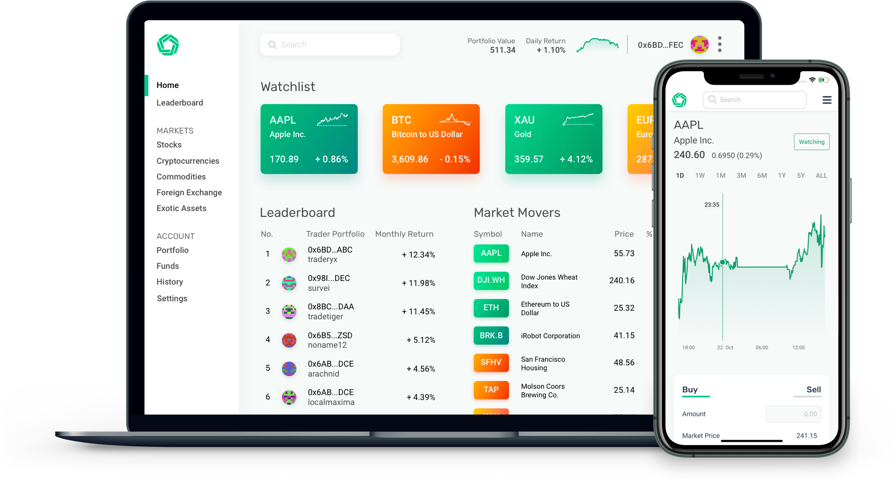

# Introduction
This is the repository for the core Morpher smart contract components of https://morpher.com

Morpher Smart Contracts are a collection of solidity files for on chain transactions and trustless state recovery from sidechain. 😳

  

---

Morpher rebuilds financial markets from the ground up on the Ethereum Blockchain. All in the pursuit of the perfect trading experience.

# Audit

The Non-Proxy versions of Morpher Smart Contracts are fully and regularly audited. 🙌

 * Audited by Solidified on April 12, 2021. [Full Report](./docs/solidified-audit-12.04.2021.pdf)
 * Audited by Capacity on April 20, 2020. [Full Report](./docs/Capacity-MorpherAudit2Result.pdf)

 # Proxied vs Non-Proxied versions

There are two versions of the smart contracts:

## Non Proxied Contracts

Initially MorpherProtocol was written in a non-proxy way using Solidity 0.5 and the Eternal Storage Pattern.

Contracts are residing on [the nonproxy-master Branch](/Morpher-io/MorpherProtocol/tree/dev)

## Proxied Contracts

# Contracts

## Interfaces
IERC20.sol: Interface for the ERC20 Token

IMorpherStaking.sol: Interface for the Staking functionality

IMorpherState.sol: Interface for the State functions

IMorpherToken.sol: Interface for the Morpher Token

## Auxiliary Contracts
MerkleProof.sol: Calculate the Merkle Proof

Migrations.sol: Used by Truffle to store migrations on chain

Ownable.sol: Ownable functionality

SafeMath.sol: Prevent Integer Overflows/Underflows in Solidity < 0.8

## Morpher Core Contracts

MorpherBridge.sol: Functionality to bridge tokens between chains in a trustless way

MorpherOracle.sol: Pricing Oracle Functionality that accepts high frequency price ticks from external trusted data sources

MorpherStaking.sol: Staking functionality for MPH

MorpherState.sol: Storing Data On Chain using the Eternal Storage Pattern (only non-proxied)

MorpherToken.sol: ERC20 Interface for the Morpher Token

MorpherTradeEngine.sol: Processing Trades, calculating the position value

## Morpher Auxiliary Contracts

MorpherAdmin.sol: 

MorpherAdministratorProxy.sol
MorpherAirdrop.sol
MorpherEscrow.sol
MorpherFaucet.sol
MorpherGovernance.sol
MorpherMintingLimiter.sol
MorpherUserBlocking.sol

