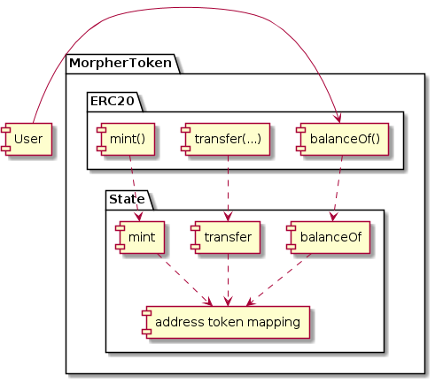
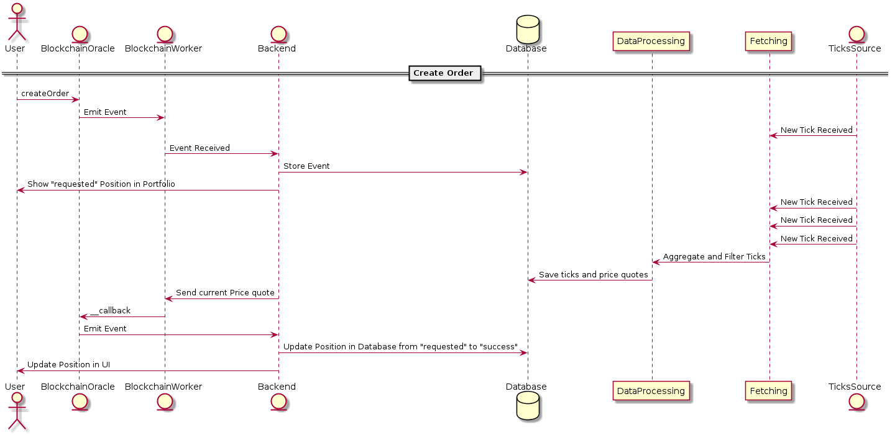
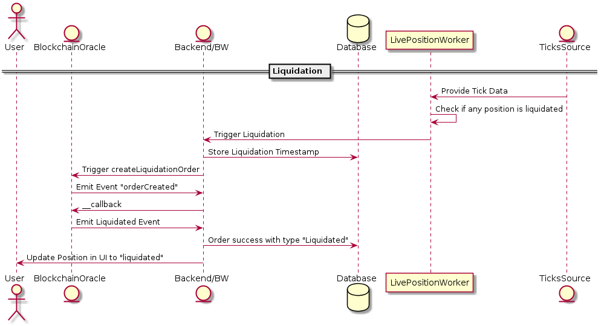

# Introduction


The Morpher Protocol is the on-chain component of the https://morpher.com platform. 

It contains all logic necessary so that 

1. Tokens can be owned and distributed in a decentralized, transparent and fair way.
2. Any Orders can be processed and, given a price by an oracle, converted into Positions
3. Positions are _owned by an account_ and not by any centralized entity

Furthermore the Protocol defines auxiliary functions, such as Governance, Staking, connecting to Layer-2 Chains, Escrow and Faucets.

In the protocol several roles are defined, which serve the purpose of separation of concerns. They can be transferred into a decentralized governance structure or deactivated when the Protocol is stable.

In short: The Protocol does everything, except getting prices for markets. This requires information from outside the EVM sandbox. An off-chain Price-Oracle answers this via a callback mechanism. As this being a  centralized element of the MorpherProtocol, a decentralized Oracle is currently in planning.


# Components Overview

This section describes components from a business perspective and showcases the involvement of the different Smart Contract of the Protocol.

It is a non-exhaustive list of functions, but should give a good overview over the main functionality. In particular the following important functions:

1. Token Generation and Transfer
1. Order creation, Oracle Callback and Position creation
1. Liquidation event
1. Mainchain-to-Sidechain transfer
1. Sidechain-to-Mainchain transfer

## Token Generation

The Token Smart Contract used has the same interface as a standard ERC20 Token. 

The creator of the token initially gets the complete token balance, which is pre-set to 425000000 MPH on Main-Chain and 575000000 MPH on Sidechain. The token-supply is not fixed, as opening a position burns tokens and closing a position mints tokens (if not liquidated).

The MorpherToken Smart Contract doesn't store any data itself, it connects to the MorpherState Smart Contract. This pattern is similar to the [Eternal Storage](https://fravoll.github.io/solidity-patterns/eternal_storage.html) pattern, where storage is running on a separate address than the logic Smart Contract. Here it runs with less abstraction and more concrete usage of state variables, more on this topic in "Upgradability and Architecture". Most importantly, no Proxy pattern is used for transparency reasons, so any upgrades of the Token will always result in a new address.

Schematically it looks like this:



The user calls balanceOf(address) and connects to Token address e.g. 0x123, which itself connects to MorpherState e.g. running on 0xabc, State returns the content of the address token mapping to Token and this returns it to the User.

Should there be any additional functionality necessary to update the Token-Logic, it can be done without migrating the Data.

## Order Creation, Callback and Position Creation

Creating an order involves two parts:

1. The user interacting with the "MorpherOracle" Smart Contract
2. The Off-Chain Oracle providing a current market price

The off-chain oracle contains several components. The reason is that the off-chain architecture is also used to show additional services such as portfolio values and history. Morpher uses the Blockchain only for those elements that _requires and benefits_ from Blockchain technology.

A classical flow of Order Creation and Callback looks like this:



1. `MorpherOracle::createOrder(...)` is called by the user directly with his own Account
1. `MorpherOracle` will call `MorpherTradeEngine` to store a pending Order. The order is stored in the TradeEngine and not in State, as it's sole purpose is to start the life-cycle of the Position.
1. The event "OrderCreated" is emitted and caught by the BlockchainWorker.
1. The BlockchainWorker will tell Backend that an Order was created.
1. Backend will store the Order in Database, which will trigger the Frontend to update the UI and show a "requested" Position
1. The Backend fetches the latest Price from Database (either PostgreSQL or Redis) for the market
1. The Backend sends the price quote back to the BlockchainWorker.
1. The BlockchainWorker is sending a transaction to the `MorpherOracle::__callback(...)` function answering with a market Price for an OrderID
1. The MorpherOracle will forward the price to the `MorpherTradeEngine::processOrder(...)`. 
1. At this point the TradeEngine does several things:
    1. Makes sure the Position can be created (checking if there is an existing position, checking if the market is really active, etc)
    1. Calculating the Shares-Amount based on the amount of MPH and marketPrice and spread (simplified: sharesAmount = MPH/(marketPrice + Spread))
    1. Storing this Position on chain in `MorpherState`
    1. Emitting an "OrderProcessed" event

1. The BlockchainWorker is getting this event and informing Backend that the Position was created successfully and stores this persistently in Database
1. The UI is updated to reflect this

## Position Liquidation and Portfolio-Value Calculation

If a position is liquidated or not depends on outside forces as well. This means, we need data with the highest resolution possible (tick data), to determine if a position got liquidated.

This is done by a component called "LivePositionWorker" which takes tick-data and determines the value of each of the positions and also determines which positions got liquidated, if any. It informs the Backend about liquidations and Backend gives those positions a Liquidation-Timestamp in database.

Next time the oracle is requested by a particular user for a particular market to change or close a position, the liquidation timestamp is sent along the __callback. This timestamp is then used by the __callback to determine if (and when) a position got liquidated.

This is visible in `MorpherTradeEngine::processOrder`

```
 // Check if previous position on that market was liquidated
        if (_liquidationTimestamp > state.getLastUpdated(orders[_orderId].userId, orders[_orderId].marketId)) {
            liquidate(_orderId);
        }
```

### Lazy vs Eager Liquidations

The System is built to provide lazy liquidations. The reason is that the same system should also work on main-chain where each transaction costs often a lot of money. If a position got liquidated, then the system not necessarily has to inform the Smart Contracts about it immediately. 

The position performance will simply stop being updated. If the user creates an Order which changes the position (increases, decreases or closes the position), the __callback will automatically include the liquidation timestamp, rendering the value of the position worthless.

On _sidechain_ an eager-liquidation mechanism is activated: The Blockchain Worker can trigger `MorpherOracle::adminLiquidationOrder(...)`, which creates an empty Order (not increasing or decreasing a position). This will trigger a __callback, which will have the liquidation timestamp set and liquidate a position.

Schematically it looks like this:



## Mainchain-to-Sidechain transfer

When MPH need to be transferred to Sidechain, they are burned on Mainchain through the MorpherBridge. This will emit a specific event `TransferToLinkedChain`. This event will have a transaction-hash attached to it, consisting of the amount, the sender, a timestamp and a nonce.  

An event-listener on sidechain is listening to this event and credits the MPH through fastTransferFromSideChain in a transparent way. It becomes audit-able that no new tokens were wrongly introduced through analyzing all transactions that happened to fastTransferFromSideChain.

## Sidechain-to-Mainchain transfer

This works through a Merkle Tree update. Every few hours a Merkle Tree, consisting of all positions and withdrawal requests, is built and sent to the Mainchain bridge. 

The user can use the Merkle Proof, provided through the app, to proof that he burned an amount X of tokens on Sidechain. This happens through `MorpherBridge::trustlessTransferFromLinkedChain`

Furthermore, a fallback mechanism is built into the protocol to allow re-claiming of all open positions in case Morpher-Sidechain systems are shut down after a grace period of 72 hours.

# Roles and Contracts

The Protocol defines a number of different roles across different Smart Contracts. 

* **Owner**:

    The owner address is used to upgrade specific smart contracts, such as the Bridge. The `MorpherState` Smart Contract inherits the `Ownable` functionality - which is a standard set of function to regulate owner-permissions, including renouncing ownership. 

    The private key for the owner is current held in a hardware wallet cold storage. Once the MorpherProtocol will be stable, ownership will be renounced.


* **Administrator**:

    The administrator address is used for administrative tasks, such as (de-)activating markets, pausing/unpausing the protocol, setting the maximum leverage, etc. It can be set by the governance.

* **Airdrop Administrator**:

    The Airdrop Administrator address can authorize addresses to receive airdrop. Once a user is authorized to receive an Airdrop by the admin, the user can claim.

* **Sidechain Operator**:

    The Sidechain Operator address is used to sync the total amount of tokens in circulation between Sidechain and Mainchain. It also regulates how much tokens can be withdrawn from Sidechain to Mainchain.

* **Callback Address 1/2/3**:

    The Callback addresses are used by the Oracle to determine who is allowed to do interact with the __callback fuction.

* **airdropColdTreasury**:

    The airdropColdTreasury is an address that stores all MPH for the Airdrop. The Private Key is stored in a hardware wallet and will only be used to top-up the airdropHotTreasury.

* **airdropHotTreasury**:

    The aidropHotTreasury is an address that is used to top-up the Aidrop Contract. The Airdrop Contract is topped up every 24h to pre-emptively avoid any bleeding in case of malfunctions.

* **morpherHotTreasury**:
    
    The morpherHotTreasury is currently not in use on either chain.

* **morpherColdTreasury**:

    The morpherColdTreasury is only used on mainchain, receives OperatingRewards.

* **morpherHotWallet**:

    The morpherHotWallet is only used on sidechain, wallet for Token purchases.

* **`MorpherAdmin` Smart Contract**:

    The MorpherAdmin Smart Contract is used to do stock splits and market delistings.

* **`MorpherState::stateAccess`**

    This mapping in `MorpherState` regulates which other Smart Contracts are considered "Platform" Smart Contracts. They are allowed to write to state variables in the MorpherState Smart Contract.

    State access can only be given or revoked be the owner.

* **`MorpherState::morpherGovernance`**:

    This variable sets the address of the governanace. 

    The Governance can (re-)set the Oracle and Administrator, but those addresses need to be voted for. It requires a lock-up in MPH Tokens to vote.

* **`MorpherState::mainChain`**:

    This variable is set to true when the protocol is deployed to Mainchain. On sidechain the transfer of tokens is only enabled for certain accounts for legal reasons. P2P Token transfer is unregulated on Mainchain.


# Upgradability and Storage Architecture

The Smart Contracts follow a pattern where storage and logic is separated from one another. The architecture chosen is deliberately not a proxy pattern, also not generalized as the EternalStorage pattern, but specific to the needs of trading. One Smart Contract is responsible for calculating a positions value (TradeEngine) and another Smart contract is simply storing a position (State). Therefore the State remains on an address, is non-destructive (no selfdestruct function), and will contain the positions, as well as tokens. It implements a simple setters and getters to store values from auxiliary Smart Contracts.

This makes it possible to upgrade specific functions without migrating the Storage. One of the latest changes to the TradeEngine and the Oracle were Stop-Loss and Take-Profit features.

This architecture is also easier to audit and review than unstructured storage proxy patterns.

The Smart Contracts are deployed using externally owned accounts and not via CREATE2, which means, they are deliberately _immutable_ and traceable.

# Unit-Tests and Test-Coverage

All main functions are tested with JavaScript unit tests. Truffle is used as a toolkit and testing framework, which relies on chai and mocha.

The tests are in the truffle-typical test folder and can be run by simply starting `truffle test`.

# Migrations

The Smart Contracts need to be deployed in a particular order. To avoid mistakes, deployment scripts are provided. Those are in the standard Truffle format as well and located in the /migrations folder.